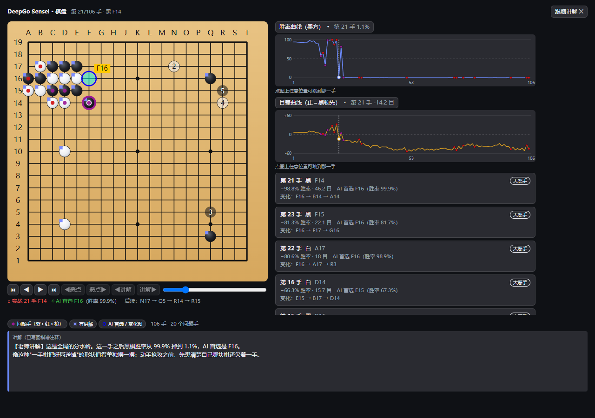
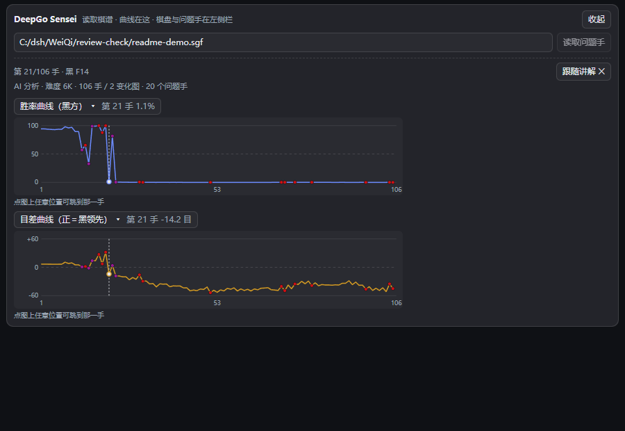
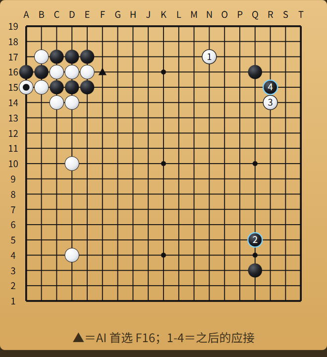
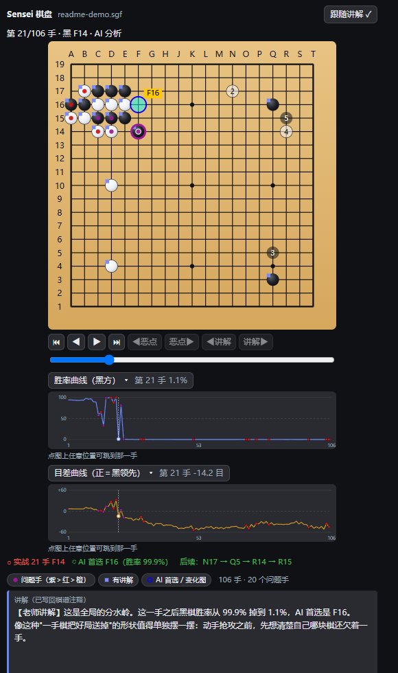

# dsh-go-sensei —— DeepGo Sensei 围棋复盘教练

给 DSH（DeepSeek Harness）装一位围棋老师。把手上一盘棋的 SGF 棋谱交给它，它会像陪练老师那样逐手讲给你听：这手棋原本想干什么、问题出在哪、改下哪里会更好。讲完可以把讲解写回棋谱文件，也可以导出一份 Markdown 复盘报告。

- **装完即用（Windows）**：插件**自带**一套 KataGo v1.16.4 + 18b 权重；棋谱里没有 AI 分析数据时自动补算，不需要你下载引擎，也不需要填任何路径。
- **没有引擎也能讲**：引擎不可用（比如 macOS / Linux 没用到自带引擎）时照样能用——这一档只讲棋理，不报胜率。
- **追问的回答带配图**：问「第 42 手改下 R16 会怎样」，回答里就直接画出那张变化图——着法按 **1-9、A-Z** 逐手编号，**三角形**标出关键棋子（还有方块/圆圈/叉/字母），配一句话图注。一张图只讲一个变化。**每张棋盘（配图与面板）上沿都写着黑方白方的名字与段位**（`PB`/`PW`/`BR`/`WR`），谁执黑不用问。
- **两张可折叠曲线看大势**：**胜率曲线**与**目差曲线**（统一黑方视角）在下方面板、左侧栏整页、右侧栏文档三处都有；问题手在曲线上点着小色点，点图上任意位置就跳到那一手。
- **棋盘在左侧栏整页与右侧栏**：列出问题手，点一行→棋盘跳到那一手（问题手彩点、AI 首选青圈、变化图半透明棋子带序号、讲解小方点；**AI 首选与变化图对每一手都在，讲解点也有**）；盘下带**图例与开关**（三类标注各自可关），Sensei 在对话里讲到哪一手，棋盘可以自动跟过去；输入框下方的面板只负责「填路径 → 读问题手 → 看两条曲线」（棋盘与问题手列表在左侧栏整页，[见下文](#web-页面上的复盘面板)）。
- **口子都留着**：想换更强的权重、换 CUDA / CPU 版引擎、调搜索量，[有五个改法](#katago-引擎自带一套不够用再换)；想确认现在用的是哪个模型，问一句「现在用的是哪个模型？」即可。
- **不需要 Java，也不需要别的围棋软件。** KataGo 是唯一可能被插件启动的外部程序。



---

## 目录

- [它能帮你做什么](#它能帮你做什么)
- [5 分钟上手](#5-分钟上手)
- [接入 DSH：安装、验证、卸载](#接入-dsh安装验证卸载)
- [配置项](#配置项)
- [KataGo 引擎：自带一套，不够用再换](#katago-引擎自带一套不够用再换)
- [棋谱要求（SGF 格式）](#棋谱要求sgf-格式)
- [棋谱从哪来（常见来源）](#棋谱从哪来常见来源)
- [对话里怎么问](#对话里怎么问)
- [Web 页面上的复盘面板](#web-页面上的复盘面板)
- [工具一览](#工具一览)
- [内置讲棋技能（随件发行）](#内置讲棋技能随件发行)
- [常见问题](#常见问题)
- [已知限制](#已知限制)
- [开发与发布](#开发与发布)
- [许可](#许可)

## 它能帮你做什么

| 你想知道的 | 你怎么说 | 你会得到 |
|---|---|---|
| 这盘棋我哪儿下坏了 | 「复盘这盘棋 `C:\棋谱\xxx.sgf`」 | 按严重程度排好的问题手：第几手、谁下的、下在哪、**大恶手 / 失误 / 不精确**、掉了多少胜率与多少目 |
| 某一手为什么不好 | 「第 42 手为什么不好？」 | 这手的意图 + 问题所在 + 更好的下法与后续变化，口语讲解**配一张图** |
| 换个下法会怎样 | 「第 42 手改下 R16 会怎样？」 | 一条主变：双方接下来怎么走、结果好不好；**回答里直接画出这张变化图**（着法按 1-9、A-Z 编号，关键棋子用三角形标出） |
| 我想看看大势怎么走的 | 打开左侧栏「Sensei 棋盘」 | 两张可折叠曲线：**胜率曲线**与**目差曲线**（统一黑方视角），点图上任意位置就跳到那一手；问题手在曲线上点着小色点 |
| 我想在自己的软件里看讲解 | 「把讲解写回棋谱」 | 逐手讲解写进**同目录的 `-sensei` 副本**的注释（标准 `C[]` 属性），任何能显示注释的打谱软件打开都能看到；源棋谱不被改动 |
| 我想要一份文字留档 | 「生成复盘报告」 | 与本次读取的棋谱同目录同名 `.review.md`：棋局信息 + 问题手表 + 已写回的讲解 |
| 只想看前半盘 / 只想看某一段 | 「只看前 50 手」 | 只讲这一段，省时省 token |

讲解由 DSH 会话里的「围棋老师」人格完成：先复述你的意图、指出问题、再给具体改进建议；术语密度按双方段位自动调整（18K~10K 用生活化比喻，9K~1D 用常规术语，2D 以上可以直接聊全局构思）。胜率与目差只是佐证——先讲棋理，再引数字。

## 5 分钟上手

```powershell
# ① 装插件（在插件的上一级目录执行；下面这行是作者机器上的路径，换成你自己的）
cd C:\dsh\WeiQi
dsh plugin --profile web add ./dsh-go-sensei

# ② 重启 dsh web，浏览器打开 http://127.0.0.1:3080
```

③ 把一份棋谱放进当前会话的工作区（或者记住它的完整路径），在对话里说：

> 复盘这盘棋 [庄生梦1n4k]vs[鍾易成1]1788532348030034222.sgf

Sensei 会自己读谱、找问题手、逐手讲解。棋谱里没有 AI 分析数据也不打紧：**插件自带 KataGo 引擎与 18b 权重（Windows）**，会自动补算，你不需要装任何东西。想换成更强的权重或换后端，见 [KataGo 引擎](#katago-引擎自带一套不够用再换) 一节。

复盘过程中产生的分析数据与讲解都写进同目录的 **`<源名>-sensei.sgf` 副本**，你给的那份棋谱不会被改动（见 [源棋谱只读](#源棋谱只读复盘产物写在--sensei-副本里)）。

## 接入 DSH：安装、验证、卸载

### 前置

| 项 | 要求 |
|---|---|
| DSH | **≥ 0.1.5-rc.1**（见 `package.json` 的 `dsh.engines.dsh`；本机实测 0.1.5-rc.1 / 0.1.5-rc.2） |
| Node.js | **≥ 22.19**（见 `package.json` 的 `engines`；本机实测 v24.19.0） |
| 运行环境 | Windows / macOS / Linux 均可；依赖只有 3 个纯 JS 包，`npm install` 即可，**无编译步骤** |
| 自带引擎 | `engine/` 里随包分发的是 **Windows x64 OpenCL** 版 KataGo + 18b 权重；macOS / Linux 需自己下载对应平台的引擎（[见下文](#自己装一套非-windows或想换后端)） |

### 安装

```powershell
# 方式一：本地目录（自己 clone 或改源码时用；装完是 link，改完重启即生效）
dsh plugin --profile web add ./dsh-go-sensei
dsh plugin --profile web add D:\path\to\dsh-go-sensei      # 也可以用绝对路径

# 方式二：直接从 GitHub 装（仓库公开）
dsh plugin --profile web add github:Zhuang-A/dsh-go-sensei
```

`dsh plugin` 会把这个包装进 `web` 这个 profile，并自动把声明了 `dsh.bundle` 的依赖加入 profile 图层列表——不需要你手工改 `bundles`。**装完重启 `dsh web` 才生效。**

> 仓库里带着引擎与权重，**约 110 MB**，clone / 首次安装会慢一些；本地目录安装用的是 `link:`，不复制文件，改完源码重启 `dsh web` 即生效。不需要自带引擎的话，删掉 `engine/` 目录即可。

### 验证装好了

```powershell
# 合成后的配置里应该能看到 go-sensei 这一层
dsh --profile web --dump-config | Select-String -Context 0,3 go-sensei
```

再看两处：

- Web 页面**输入框下方**出现一行「**DeepGo Sensei**」+「展开」按钮 → 浏览器端加载成功。
- 对话里随便问一句围棋，比如「帮我看看这盘棋」→ 模型开始用围棋老师的口吻回应，并能列出 `go_*` 系列工具 → 宿主端加载成功。

### 升级与卸载

```powershell
dsh plugin --profile web update dsh-go-sensei        # 升级（本地 link 安装无需此步）
dsh plugin --profile web remove dsh-go-sensei        # 卸载
```

卸载后重启 `dsh web` 并刷新页面：面板与样式都不会残留。

## 配置项

**全部可选，一个都不配也能用。** 配置写在 profile 的补丁层文件里：

```
%USERPROFILE%\.dsh\profiles\web\cordis.patch.yml      # Windows
~/.dsh/profiles/web/cordis.patch.yml                  # macOS / Linux
```

（若你设过 `DSH_HOME`，就是 `$DSH_HOME\profiles\web\cordis.patch.yml`。目前 Web 设置页里没有 Sensei 的配置卡片，改配置请直接编辑这个文件。）

```yaml
# ── DeepGo Sensei ─────────────────────────────────────────
# 全部可选：一段都不写也能用（自带引擎会自动被发现）。
# 路径用正斜杠，既被 Windows 接受，也避免 YAML 反斜杠转义踩坑。
- id: go-sensei
  config:
    level: auto                 # 讲解难度 18K..1K/1D..9D，或 auto（按双方段位自适应）
    winrateThreshold: 0.03      # 问题手胜率落差阈值（0~1 小数）
    scoreThreshold: 3           # 问题手目差阈值（目）
    maxCandidates: 10           # 每次复盘最多返回多少个问题手
    pvDepth: 6                  # 每条变化图保留多少手
    tokenBudget: 50000          # 单局讲解的 token 预算（软约束）
    engineDir: ''               # 引擎目录；留空＝用插件自带的 engine/
    kataGoPath: ''              # 可选：可执行文件（默认取 engineDir 里的 katago）
    kataGoConfig: ''            # 可选：analysis 配置（默认取 engineDir 里的 analysis_example.cfg）
    kataGoModel: ''             # 可选：权重文件；留空＝自动挑 engineDir 里最大的 *.bin.gz
    maxVisits: 100              # 补算每手搜索量：越大越准越慢
```

没写的键一律用默认值。各项含义：

| 配置项 | 默认 | 作用 |
|---|---|---|
| `level` | `auto` | 讲解难度；`auto` 时按棋谱双方段位取**较弱**一方（照顾初学者） |
| `winrateThreshold` | `0.03` | 胜率落差超过该值即算问题手（3% 是 KataGo 的"失误线"） |
| `scoreThreshold` | `3` | 目差落差超过该值也算问题手（与胜率通道任一触发即标记） |
| `maxCandidates` | `10` | 单次复盘返回的问题手上限（按严重度排序取前 N） |
| `pvDepth` | `6` | 每条候选变化图截断到几手 |
| `tokenBudget` | `50000` | 单局讲解预算，写进人设段作为软约束 |
| `engineDir` | `''` | 引擎目录（放可执行文件 + analysis 配置 + 权重）。**留空＝用插件自带的 `engine/`** |
| `kataGoPath` | `''` | 可执行文件路径；留空＝取 `engineDir` 里的 `katago` / `katago.exe` |
| `kataGoConfig` | `''` | analysis 配置路径；留空＝取 `engineDir` 里的 `analysis_example.cfg` |
| `kataGoModel` | `''` | 权重路径；**留空＝自动挑 `engineDir` 里最大的 `*.bin.gz`**（再退回配置里的 `modelFile`） |
| `maxVisits` | `100` | 补算每手搜索量 |

引擎不可用（非 Windows 且没配 `engineDir`）时，`go_engine_analyze` 不会注册，复盘自动走纯棋理模式；随时可以让 Sensei 调 `go_engine_info` 看当前状态与改法。

## KataGo 引擎：自带一套，不够用再换

### 先判断你会走到哪条路

| 你的棋谱 | 插件会怎么做 | 要自己装引擎吗 |
|---|---|---|
| 自带 AI 分析数据（`WV[]`/`LZ[]` 属性，或注释里有胜率行） | 直接读棋谱里的分析来讲解 | ❌ 不用 |
| 没有任何分析数据（野狐导出的对局大多是这种） | 用**插件自带的引擎**自动补算问题手，再讲解 | ❌ 不用（Windows） |
| 没有任何分析数据，且引擎不可用 | 走「纯棋理」模式：只讲棋理，不虚构胜率与变化图 | ✅ 需要（非 Windows，见下文） |

怎么判断棋谱有没有分析数据：用记事本打开 `.sgf`，搜 `WV[` 或 `LZ[`，或者搜「胜率」。搜得到就是自带分析。

### 开箱即用：插件自带的 18b 引擎

`engine/` 目录随插件分发，**不需要填任何配置**就能补算：

| 文件 | 是什么 |
|---|---|
| `katago.exe` | KataGo **v1.16.4**，OpenCL 后端（Windows x64） |
| `*.dll` | 引擎必需的运行库（缺一个就起不来） |
| `analysis_example.cfg` | analysis 模式配置（官方版本，未改动） |
| `kata1-b18c384nbt-….bin.gz` | 18b 权重（约 93 MB），业余复盘足够 |
| `LICENSE.txt` | KataGo 的 MIT 许可与第三方组件声明 |

想确认现在到底在用哪套引擎、哪个权重，直接问一句「现在用的是哪个模型？」，Sensei 会调 `go_engine_info` 念给你听。

### 换引擎 / 换权重 / 调速度：五个口子

| 你想做什么 | 怎么改 |
|---|---|
| **换更强的权重**（如 b28，约 270 MB） | 把 `.bin.gz` 丢进 `<插件目录>/engine/`，插件自动挑其中**最大**的那个 |
| **指定某个权重文件** | 配置 `kataGoModel: <权重文件的完整路径>`（下载的 `.bin.gz` 放哪就填哪） |
| **换引擎或换后端**（CUDA / 纯 CPU 版 / 别的版本） | 配置 `engineDir: <你的引擎目录>`，该目录里放可执行文件 + analysis 配置 + 权重即可 |
| **只临时换一次**（不动配置） | 让 Sensei 在 `go_engine_analyze` 里带上 `engineDir` / `kataGoPath` / `kataGoConfig` / `kataGoModel` 参数：带 `engineDir`＝整个引擎目录换掉（目录内自动发现），只带某一项＝只覆盖那一项 |
| **调搜索量**（越大越准越慢） | 配置 `maxVisits`（默认 100；业余复盘 60~200 都合理） |

生效时机要分清：权重与路径**每次调用都重新解析**，所以往 `engine/` 里丢一个新权重，下一盘复盘就用上了；而 `go_engine_analyze` 这个工具本身注册与否在插件加载时决定，改了 `engineDir` / `kataGoPath` 记得**重启 `dsh web`**。想强制重算某盘棋（不吃缓存），用 `go_engine_analyze` 指定手数区间。

### 自己装一套（非 Windows，或想换后端）

自带的是 Windows x64 OpenCL 版：**macOS / Linux 上插件不会自动启用它**，需要自己下载对应平台的引擎，再把 `engineDir`（或 `kataGoPath`）指过去。人肉装机要备齐三样，缺一不可：

1. **`katago` 可执行文件** —— 版本 **v1.14 以上**（v1.14 起 analysis 模式默认 JSON 协议；自带的是 v1.16.4）。
2. **模型权重** —— 形如 `kata1-b18c384nbt-….bin.gz` 的文件。
3. **一份 analysis 配置文件** —— 必须是 analysis 配置，**不能**拿 GTP 配置顶替。

**步骤 1：下载引擎**

打开 [KataGo releases](https://github.com/lightvector/KataGo/releases)，挑一个匹配你系统的压缩包，按机器选后端：

| 你的机器 | 选哪个 | 说明 |
|---|---|---|
| 有独显、想最省事 | **opencl** 版 | NVIDIA / AMD / Intel 都能用，需要显卡驱动带 OpenCL |
| NVIDIA 显卡，愿意折腾驱动 | cuda 版 | 最快，但要装对应版本的 CUDA 运行库 |
| 没有独显 / 只有核显 / 不想碰驱动 | **eigen** 或 `eigenavx2` 版 | 纯 CPU，慢一些但一定能跑 |
| 服务器、专业显卡 | tensorrt 版 | 最快也最挑环境，新手不建议 |
| macOS | metal 版（v1.16+） | Apple 芯片走 Metal |

解压到一个固定目录，例如 `D:\katago\`。

> ⚠️ **整个目录一起留着，别只拷 `katago.exe`。** 它依赖同目录的一堆 DLL（`libcrypto-3-x64.dll`、`libssl-3-x64.dll`、`libz.dll`、`libzip.dll`、`msvcp140*.dll`、`vcruntime140*.dll`），只拷 exe 会启动即失败。

**步骤 2：下载模型权重**

到 [katagotraining.org](https://katagotraining.org/) 下载最新的权重文件：

- **b18c384nbt**（约 98 MB）：够业余棋友复盘用，推荐先用这个。
- **b28c512nbt**（约 270 MB）：更强也更慢，机器好再上。

放进同一个目录，例如 `D:\katago\kata1-b18c384nbt-s9996604416-d4316597426.bin.gz`。

**步骤 3：准备 analysis 配置文件**

用引擎目录里自带的 **`analysis_example.cfg`**（官方压缩包里就有），**不需要改任何一行**：

- 搜索量由插件在查询里指定（`maxVisits`，见配置项），配置文件里的 `maxVisits` 不生效。
- 插件会额外加 `-override-config numAnalysisThreads=1`，避免多线程和单次查询抢资源。
- 配置里的 `reportAnalysisWinratesAs` 决定胜率视角（随包配置实测是 `BLACK`），插件会读这一个键做口径换算——所以别删它。

如果你的压缩包里没有这个文件，从官方仓库取：
<https://raw.githubusercontent.com/lightvector/KataGo/master/cpp/configs/analysis_example.cfg>

> ⚠️ **别拿 GTP 配置顶替**（形如 `default_gtp.cfg`、`myconfig.cfg` 的那类）。GTP 配置缺 analysis 模式必需的键，引擎会直接报 `Could not find key`。

**步骤 4：先自己验证一次引擎**

```powershell
# 尖括号是占位符，换成你实际的位置（本文档别处的 D:\katago 只是示例目录名）
<你解压引擎的位置>\katago.exe version
```

正常输出（本机实测）：

```
KataGo v1.16.4
Git revision: 4b8de63bea2bd8790db96cd6f8daf86dc87be6f7
Compile Time: Oct 20 2025 12:25:23
Using OpenCL backend
```

能打印版本号与 `Using <后端> backend` 就算过了。这一步报错就先别往插件里填，先把引擎跑通。

**步骤 5：把它填进插件配置**

回到 [配置项](#配置项)，在 `%USERPROFILE%\.dsh\profiles\web\cordis.patch.yml` 里写：

```yaml
- id: go-sensei
  config:
    engineDir: <你的引擎目录>      # 该目录里有 katago 可执行文件、analysis 配置、权重
    maxVisits: 100
```

（`<你的引擎目录>` 是占位符——填你自己解压引擎的位置，别照抄本文档里的示例目录名。
也可以更细：`kataGoPath` 指可执行文件、`kataGoConfig` 指配置文件、`kataGoModel` 指权重，三者各自覆盖 `engineDir` 里的自动发现。）

重启 `dsh web`。之后凡是**没有分析数据、19 路**的棋谱，`go_review_moves` 与 Web 面板都会**自动补算**，不需要你手动调工具；补算失败不会打断复盘，会降级成纯棋理模式并把失败原因如实带回。

### 自带引擎的边界

- **平台**：自带的 `katago.exe` 是 Windows x64 OpenCL 版，其他平台不会自动启用，请走上面的"自己装一套"。
- **许可**：引擎与权重按 KataGo 官方 MIT 许可随插件分发（第三方组件声明见 `engine/LICENSE.txt`），上游条款以官方发布为准。
- **体积**：仓库因此约 110 MB，clone 会慢一些；不需要自带引擎的话，删掉 `engine/` 即可（插件会退回"自己装 / 纯棋理"两条路）。
- **显卡**：OpenCL 后端要求显卡驱动带 OpenCL 运行时；驱动太旧或纯远程桌面环境可能起不来，换成 CPU（eigen）版最稳。
- **首次运行会写调优缓存**：第一次补算要做 OpenCL 调优（本机实测同一查询首次 **214 秒**、第二次 **8.7 秒**），缓存落在 `engine/KataGoData/`（已在 `.gitignore` 里，删掉下次会重新调优）；运行日志在 `engine/analysis_logs/`。

### 常见装机坑

| 现象 | 原因与解法 |
|---|---|
| 自带引擎也报「没有可用的 KataGo」 | `engine/` 目录被删或移走了；恢复它，或配置 `engineDir` 指向你自己的引擎 |
| 引擎起不来 / 一闪而过 | 只拷了 exe 没拷 DLL；或后端和自己的显卡不匹配（用 `katago.exe version` 验证） |
| `Could not find key` | 配置文件用错了——需要 analysis 配置，不是 GTP 配置 |
| `Must be a integer or half-integer from -150.0 to 150.0`（`field` 却写着 `rules`） | 这是**贴目**超范围/非半整数，不是规则字符串的问题（KataGo v1.16.4 实测会把字段误标为 `rules`）。插件已把棋谱 `KM[]` 就近吸附到 0.5 的倍数并夹到 `[-150, 150]`；仍报则检查棋谱贴目 |
| 第一次补算等很久 | 每次补算都要新起一个引擎进程并加载模型，**首次运行还要做 OpenCL 调优**（本机实测首次 214 秒、第二次 8.7 秒），之后一直快；调优缓存见上文 |
| 补算太慢 | 把 `maxVisits` 调小（60~100 足够业余复盘用）；或换更小的模型 |
| 补算被拒 / 报子进程不可用 | 引擎查询被拒会把引擎原始错误带回；受限沙箱下启动子进程也可能被系统拒绝，工具会照实说明 |

补算耗时会在 `go_engine_analyze` 的返回里以 `seconds` 字段给出，跑几次就有直观感受。

## 棋谱要求（SGF 格式）

### 基本要求

| 项 | 要求 |
|---|---|
| 文件 | 磁盘上一个 `.sgf` 文件，路径可以是绝对路径，也可以相对当前会话工作区 |
| 内容 | 标准 SGF（`(;GM[1]FF[4]SZ[19]…`），**主变化线就是实战手顺** |
| 手顺 | 只复盘**主变化线**（每个节点第一个子节点）；谱中的变化图/旁支会被统计但不逐手讲解 |
| 多局 | 一个文件里有多局时，只复盘第一局 |
| 题目型 | 只有摆子（`AB`/`AW`）没有实战手顺的死活题/布局题，没有可复盘的手 |

主变化线之外的手数不影响使用：在打谱软件里摆过的变化图、做过的手顺标记都可以留着。

### 源棋谱只读：复盘产物写在 `-sensei` 副本里

**Sensei 从不修改你给的棋谱文件。** 所有写回（AI 分析数据 + 逐手讲解）都落在同目录的副本上：

```
QiPu/091301[甲]vs[乙]1789308106030024548.sgf          ← 源棋谱：逐字节保持原样
QiPu/091301[甲]vs[乙]1789308106030024548-sensei.sgf   ← 复盘副本：WV/DM/LZ 分析 + C[] 讲解
QiPu/091301[甲]vs[乙]1789308106030024548-sensei.review.md  ← 复盘报告（跟着副本命名）
```

- **写**：`go_write_review`（讲解）、补算写回的分析数据、`go_export_report`（报告）都写进副本；副本不存在时由第一次写入创建（内容是源棋谱 + 这次写入的东西），已存在时在它上面继续追加。
- **读**：同一盘棋，若副本已存在，工具与面板**都读副本** —— 那才是上一次复盘的成果（分析数据 + 讲解）。所以复盘过的棋谱再打开是秒开，不会因为"源文件里没有分析数据"而重算一遍。
- **想强制读源文件**：把副本删掉/改名，或直接给副本路径（`xxx-sensei.sgf` 不会再叠一层后缀）。
- 副本名只由源文件名决定，与复盘次数无关：同一盘棋反复复盘，始终更新同一个副本。

### 编码：不用管，插件自己认

- 优先按 **UTF-8** 严格解码；不是 UTF-8 就回退 **GBK**（野狐、部分国产导出器常见）。
- 棋手名/棋局名若是「UTF-8 被当 GBK 解」的双重乱码，插件会尝试**无损回修**；修不干净时保留原文并给出 warning（不影响棋局分析）。
- 写回注释后**副本**统一存为 **UTF-8**（源棋谱的编码与字节不动）。

### 会被读取的属性

| 属性 | 含义 | 用途 |
|---|---|---|
| `SZ` | 棋盘路数 | 缺省按 19 路；**补算只支持 19 路** |
| `KM` | 贴目 | 传给引擎；旧式 `KM[375]` 这类百分制写法会先归一化成 3.75 |
| `HA` | 让子数 | 补算支持 **2~9 子**，更多子数会明确报错 |
| `RU` | 规则 | 含 `japan` 按日本规则，其余按中国规则传给引擎 |
| `PB`/`PW`/`BR`/`WR` | 棋手与段位 | 用于 `level: auto` 判断讲解深浅 |
| `RE`/`DT`/`GN`/`EV`/`AP` | 结果/日期/棋局名/赛事/软件 | 出现在复盘信息与报告里 |

### 分析数据：三种写法都认

棋谱里只要有**任意一手**带分析数据，插件就直接用，不再补算。识别三种常见写法：

1. **KataGo 标准属性**：`WV[]`（白方视角胜率）、`DM[]`（黑方视角目差）、`PV[]`（后续变化）。
2. **分析属性**：`LZ[]` / `LZOP[]`（部分打谱软件保存分析数据时写入的私有属性）。
3. **注释里的胜率行**：把分析写进 `C[]` 的软件，形如 `Move 42 黑胜率: 94.3% (±0.1%) (KataGo-18b / 1.0k 计算量)`。插件按通行口径解析这类文本。

### 无分析数据 + 引擎可用 → 自动补算

触发条件（三条同时满足）：

- **引擎可用**：插件自带的 `engine/` 能解析到（Windows），或用 `engineDir` / `kataGoPath` 指向了自己的引擎；
- 棋谱**完全没有**分析数据（有一手带分析就不触发）；
- 棋盘是 **19 路**。

补算失败不阻断复盘：自动降级为纯棋理模式，并把原因（引擎退出码、引擎拒绝查询的原文、子进程不可用等）带回。

## 棋谱从哪来（常见来源）

| 来源 | 怎么拿到 | 注意 |
|---|---|---|
| **野狐（腾讯围棋）** | 对局结束后在棋谱/历史对局里「保存棋谱 / 导出 SGF」，文件名形如 `[庄生梦1n4k]vs[鍾易成1]1788532348030034222.sgf` | 常见 **GBK 编码**（插件自动识别）；导出的是对局记录，**一般不含 AI 分析数据**，想让 Sensei 出胜率与候选点就配 KataGo 补算 |
| **弈城（Tygem）** | 复盘界面里保存 SGF | 编码可能是本地编码；棋手名万一乱码，插件会尝试自愈 |
| **OGS / KGS 等网络平台** | 对局页面「下载 SGF / Export」 | 一般是 UTF-8，直接能用 |
| **电脑上自己下的棋** | Sabaki、CGoban 等打谱软件保存的 SGF | 若软件支持"保存分析数据"，导出的棋谱会自带胜率与候选点 |
| **AI 自战 / 让子对局 / 教练给的谱** | 直接拿文件即可 | 让子棋补算支持 2~9 子 |
| **只有图片或纸质棋谱** | 先用打谱软件把棋摆一遍再导出 SGF | 插件只吃 `.sgf` 文件，不能从图片或剪贴板里读棋谱 |

**棋谱放哪、怎么写路径**

- 放进当前会话的工作区目录，对话里直接写文件名就行；也可以给绝对路径（如 `C:\棋谱\2026-09-12-对局.sgf`）。
- 野狐导出的文件名带中文与方括号 `[]`，Windows 下照抄即可；路径里有空格时用引号包起来，或在输入框里用 `@` 引用文件。
- 相对路径按**当前会话工作区**解析；Web 面板除了会话工作区，还会在你最近复盘过的目录里按文件名做一次有界查找。

## 对话里怎么问

```text
复盘这盘棋 C:\棋谱\2026-09-12-对局.sgf
只看前 50 手，后面官子先不用讲
第 42 手为什么不好？我是 5K，讲简单点
第 42 手改下 R16 会怎样？给一条主变就行（回答里会配一张变化图）
把讲解写回棋谱
生成复盘报告
```

- 想省 token：先说「只看第 1~60 手」，再逐段追问。
- 同一局反复问：命中同局面缓存（工具返回 `cached: true`），不会重复消耗。
- 讲解口吻、术语密度都可以直接提要求（「讲简单点」「讲深一点」），Sensei 会照办。
- 追问涉及具体变化时，回答会带配图（[见下文](#追问的回答会带配图)）；不想看图就说「不用画图，讲重点」。
- 左侧栏整页与右侧栏文档里「点一行 / 点交叉点」得到的追问语，末尾都写明了「画一张变化图」——配图靠模型主动调工具，在提问处写明比只写进人设可靠。

## Web 页面上的复盘面板

三处视图各有分工：**输入框下方的面板**管「填路径 → 读棋谱 → 看曲线」，**左侧栏整页**看棋盘与讲解，**右侧栏文档预览**跟着对话一起看。同一盘棋、同一手在三处同步（共用一份视图状态，数据都来自宿主）。

### 访问控制：面板与界面共用同一道登录闸门（局域网可用）

插件往宿主注册了四条只读路由（`/go-sensei/roots`、`/focus`、`/diagram`、`/review`），浏览器面板与对话配图都靠它们取数据。这些路由**直接挂在 webServer 上**，而宿主默认监听 `0.0.0.0`（局域网可访问），所以它们各自先过一道闸门：

- 闸门实现 = DSH `connection` 服务的 `requestRejection()`，与界面自身的 `/api` **完全同一道**：
  1. **Host/Origin 围栏** —— Host 必须是 loopback 或本机局域网地址，且 `Origin` 与 `Host` 同源、`Sec-Fetch-Site` 不是 `cross-site`（挡 DNS rebinding 与跨站请求）；
  2. **浏览器会话 cookie** —— 必须持有该 authority 的签名 cookie（由打开带 `?token=…` 的界面地址时铸出）。
- 因此**在局域网里用面板的前提，就是能在局域网里用界面**：换设备 / 清了 cookie 后请用带 token 的地址重新打开一次界面；没登录过的设备一律 `401`，跨站请求一律 `403`。
- 拿不到 `connection` 服务时（纯 CLI 组合，或极简宿主）闸门退回「仅本机来源」，局域网面板随之不可用——宁可如此，也不留一个无鉴权又对外的读文件接口。

其余硬化：

- **读取范围（包含校验）**：`/review` 与 `/diagram` 接受的 `?path` 必须落在**宿主的已知工作区根**之内 —— 会话工作区、模型复盘过的棋谱所在目录、以及面板默认根。这些根之外的路径一律 `404` 并给出可操作提示；判定发生在 `readBytes` **之前**，对绝对路径连 `stat` 都不做（不给"这个文件存不存在"做探针）。想让某个目录可用：在对话里让 Sensei 复盘一次那盘棋，宿主就会记下它所在的目录。
- **`?cwd` 不构成放行依据**：它只在**本身已经是已知工作区根**时才作为本次请求的解析基准，否则直接拒绝 —— 否则调用方自造的基准会让包含校验自我作废。`roots` 仍只由工具执行与会话根补充。
- `/review` 有窗口限流（10 秒 / 20 次）与在飞上限（2 个），超限回 `429`/`503`（这条路由在没有分析数据时会现场启动 KataGo）。
- 错误响应只回通用文案，原始异常与工作区根列表只写宿主日志。

### 输入框下方的面板

Web 页面**输入框下方**有一行折叠面板「**DeepGo Sensei**」：

1. 点「展开」，填入 SGF 路径（相对工作区，或**已知工作区之内**的绝对路径 —— 范围见上一节的「读取范围」）；
2. 点「读取问题手」，状态行给出「停在第几手 · 这一手的坐标」，往下是两条可折叠的曲线；有问题手时行末写明「N 个问题手」，没有分析数据 / 补算失败时也照实说明；
3. 就这样——**面板不画棋盘，也不列问题手**（输入框下方地方小，又要给输入框让位）：棋盘、问题手列表与讲解都在左侧栏整页，见下文。



面板只管「读」。要追问就点左侧栏整页或右侧栏里的一行（追问语会**复制到剪贴板**），粘到下面的输入框回车即可。

### 胜率 / 目差曲线（三处视图都有）

每盘棋都带两条**可折叠**的曲线，横轴＝手数、纵轴＝**黑方视角**（胜率越高 / 目差越正＝黑越好），点表头即可收起：

| 曲线 | 纵轴 | 说明 |
|---|---|---|
| 胜率曲线（黑方） | 0~100%，50% 处一条虚线 | 一条曲线看完整盘棋的攻守转换，突降处就是转折 |
| 目差曲线（正＝黑领先） | 关于 0 对称，自动取到 ±10/±20… 的整数档 | 胜率在均势区刻度很陡，**判断"亏了多少"要看目差** |

- **问题手在曲线上点着小色点**（紫＝大恶手、红＝失误、橙＝不精确），一眼能看出"哪几手把棋下坏了"；
- **竖直虚线是当前手**，表头同时给出这一手的数值（如「第 81 手 2.9%」「第 81 手 −8.3 目」）；
- **点图上任意位置就跳到那一手**，与棋盘上点交叉点是同一种手感；
- 三处视图（下方面板 / 左侧栏整页 / 右侧栏文档）共用同一条折叠状态，在哪儿收起，别处也收起。

数据口径由宿主一次算清（棋谱里 `WV[]` 是白方视角、`DM[]` 是黑方视角、`LZ[]` 是落子者视角、注释里的胜率又是另一套），浏览器只负责画 —— 所以三处视图上的同一条曲线永远是同一条。

### 内置棋盘（在左侧栏整页与右侧栏里）

棋盘**不在**输入框下方的面板里（那里地方小、又要给输入框让位）。看棋盘有两个入口：**左侧栏的「Sensei 棋盘」整页**（棋盘在左，曲线与问题手列表在右，讲解整幅在底部），或在对话里点开 `.sgf` 文件时的**右侧栏文档预览**。盘上的记号：

**棋盘上沿写着黑方白方的名字**（`● 黑 庄生梦1n4k（18级）` … `白 鍾易成1（17级） ○`）：名字取自棋谱根节点的 `PB`/`PW`，段位取自 `BR`/`WR`，棋谱没写名字时这一条不占位、盘面照旧。讲解配图（`go_draw_diagram`）画的是同一张盘，同一条名条也在。

| 盘上的记号 | 含义 |
|---|---|
| 反色小圆点 | 最后一手（黑子上白点、白子上黑点） |
| **小色点**（紫色 / 红色 / 橙色） | 已经下过的着法里**被评为问题手**的那些：紫＝大恶手、红＝失误、橙＝不精确 |
| **紫 / 红 / 橙**圆圈 | 当前停在的**这一手**是问题手，颜色＝严重度（大恶手 → 失误 → 不精确） |
| **蓝色小方点**（棋子左上角） | 这一手棋谱写回**讲解**（`C[]` 注释），翻到哪手读哪手 |
| **青色实心圆 + 蓝圈** | AI 首选点，旁边橙底黑字给出它的胜率 |
| **半透明棋子 + 正中序号** | **变化图**：首选之后的后续几手（改下首选之后，对方会应哪里、我又下哪里）。每一手都画成一颗半透明棋子（按轮转分黑白，黑棋上白字、白棋上黑字），序号 2、3… 就是这条变化里的第 2、3 手（序号 1 ＝首选那一点）。画法照 [Lizzieyzy](https://github.com/yzyray/lizzieyzy) 的 ghost stone，只是取半透明 —— 底下的实战棋子还得看得见 |
| **小黑块 / 小白块** | **形势判断**（独占模式，默认不显示）：点控制条的「形势判断」后，盘上把黑地/白地画成小方块、未定处留白，死子则在棋子上盖对方颜色的方块；棋盘右侧同时开出数字浮窗 |

**AI 首选与变化图不只给问题手看**：只要棋谱里有候选着法（`LZ[]`，补算过的棋谱都有），翻到**任意一手**盘上都会画出首选点、它的胜率，以及**首选之后的后续几手**——**包括「有讲解」但没被评为问题手的那几手**（老师在好手、关键处同样会写讲解，那些手以前是空白的）。不是问题手时，盘下那行也会直接写出「◌ AI 首选 Q16（胜率 56.3%）　后续：D4 → Q4」，并在本手有讲解时提示「本手有讲解（见下方）」。这一层归「AI 首选 / 变化图」开关管，关掉后盘上与文字一起消失。

**盘上的标注都只标"已经下到"的那几手**：停在开局时盘面是干净的，问题点与讲解点随棋局展开一处处出现——这样一眼能看出"讲到哪儿了"，而不是一上来就满盘记号。

**图例就在棋盘下面**，每项＝色样 + 名称的小胶囊，**点一下即可开/关**那一类标注（关掉的项变淡划掉），三项分别是「问题手」「有讲解」「AI 首选 / 变化图」。开关是三个视图共享的：在下方面板关掉，右侧栏与整页棋盘同时生效。只想安静看棋形时，把三类全关掉即可。（**形势判断**不在这里：它是控制条上的一个按钮，按下即进入独占模式，见 [形势判断](#形势判断引擎归属图)。）

- **载入后自动停在最严重的那一处问题手**（列表第一行就是它），圆圈与色点立刻可见；没有问题手时才停在末手。
- 控制条：`⏮ ◀ ▶ ⏭` 逐手前后翻；**`◀恶点` / `恶点▶` 直接跳到上一处 / 下一处问题手**，**`◀讲解` / `讲解▶` 跳到上/下一处有讲解的手**（都到头绕回另一端，方便把每个恶点过一遍）；右侧滑块**拖动快速定位**。表头实时显示「第 N/M 手 · 黑 Q16」。
- **第一次读没有分析数据的棋谱要等一会儿**：宿主会用自带的 KataGo 现场补算（实测一盘 87 手的棋谱约 **87 秒**，机器与 `maxVisits` 不同会有出入）。这期间按钮上是「读取中…」，面板会另起一行说明「正在用 KataGo 补算」，算完自动出结果——**不是卡死**。同一盘再读就走缓存，很快。
- **点盘上任意交叉点**：就这个点复制一句追问（「这里如果下在 Q16 会怎样？」），你不用自己算坐标——粘到输入框回车即可。
- **跟随讲解**（默认开）：Sensei 在对话里读到哪一盘、讲到第几手，棋盘与曲线就自动切过去——它调用 `go_position_context` 看第 42 手，三处视图的棋盘就都停在第 42 手的局面。
  - 还没载入棋谱时它照样守着：Sensei 一讲到某盘棋，棋盘就把那盘棋**自动载入**，你不用先知道路径；
  - 你手动「读取问题手」会**认掉当前这条指针**，旧的讲解不会把你刚选的棋谱抢走；只有**新的**讲解事件（比如 Sensei 又开始讲另一手）才会切过去；
  - 问宿主的频率：每 3 秒一次，纯内存查询（不读盘）。关掉开关即纯手动。
- 棋子与标记的配色照着 [Lizzieyzy](https://github.com/yzyray/lizzieyzy) 的棋盘渲染来（最后一手反色圆点、失误按严重度取紫/红/橙、首选点青色圆加蓝圈、推荐点信息橙底黑字、**变化图后续几手＝ghost stone 棋子 + 变化序号**），平时用惯了那套配色的话，两边"哪个点是什么意思"能直接对上。
- **已写回的讲解直接显示在盘下**：翻到某一手时，只要这一手在棋谱里有 `C[]` 注释（即 Sensei 用 `go_write_review` 写回去的那段讲解），棋盘下方就出现「讲解（已写回棋谱注释）」框，翻到哪手读哪手；问题手列表里对应行也会标出「有讲解」。

### 形势判断（引擎归属图）

照 [Lizzieyzy](https://github.com/yzyray/lizzieyzy) 的判定规则做的：**盘上把地画出来、棋盘右侧的浮窗把目数报出来**，滑块拖到哪一手就按那一手的局面算。

**默认不显示**。在控制条上点「**形势判断**」才进入，而且它是**独占模式**：进入后只留地盘与浮窗，讲解小方点、问题手色点、AI 首选与变化图全部隐去，**整页视图右列的曲线与问题手清单也一起让位**（棋盘那一列随之外扩，专看地盘与数字）；点浮窗右上角的 **×**（或再按一次按钮）退出，并**恢复到按下按钮之前**的显示状态（进入前是开的还开、是关的还关）。

数据来自**引擎的归属图**（KataGo analysis 的 `ownership`，与胜率/目差出自同一次搜索），判定只有三条规则：

1. **阈值 0.4**：`|归属| < 0.4` 的点算**未定**，不画也不计（盘上留白）；
2. **四邻过滤**：一个空点就算倾向黑，只要四个邻点里有一个不倾向黑，它也不算黑地（防孤点、画面干净）；白方对称；
3. **死子判定**：落在对方区域里的己方棋子按死子算——盘上在**那颗子上**盖对方颜色的小方块，并记进对方的「地」。

计分用**数子法**：目 ＝ 活子 ＋ 地（未定不计），**领先 ＝ 黑目 − 白目 − 贴目**。浮窗里逐项报出来，形如：

> **形势判断**
> 白领先 35 目（不贴目）
> 甲（黑）　145 目
> 乙（白）　180 目
> 提子　　　黑 3 · 白 1

**没有归属数据时会当场补算**：第一次点开若这盘棋还没算过（包括**以前复盘过、只写了胜率/目差的老副本**），会跑一次引擎（几十秒，浮窗里显示「正在补算」），算完把归属图写进 `-sensei` 副本的 `TP[]`，以后打开秒出。**引擎不可用时按钮禁用**并说明原因——不拿估算顶包。

口径注意：这里的目数是**点目**（盘上点数的合计），与目差曲线（引擎 `DM`，黑方视角）**不是同一个数**；讲地盘归属用前者，讲领先多少目优先用后者，不要并排报两个数。

配图也能用：`go_draw_diagram` 加 `territory: true`，生成的 SVG 上叠同样的地块、图下附一行形势判断，工具返回值里也带着那行数字（模型应直接引用它，不要自己另算）。

### 补算结果会写回棋谱（所以不必每次重算）

没有分析数据的棋谱要现场补算（本机实测 96 手约 **29 秒**）。补算完成后，插件会把**逐手胜率、目差，以及 AI 首选与变化图**一起写进 `-sensei` 副本：

| 属性 | 含义 | 口径 |
|---|---|---|
| `WV[]` | 该手之后的胜率 | **白方视角**（KataGo 标准，与解析端同一口径） |
| `DM[]` | 该手之后的领先目数 | **黑方视角** |
| `LZ[]` | 该手之后的候选着法（**AI 首选 + 变化图**） | 头部落子者视角、候选记该节点行棋方视角（与 Lizzieyzy 同一写法，`go_*` 与第三方打谱软件都能读） |
| `TP[]` | 该手之后的**形势判断三档图**（黑地/白地/未定） | 每点 2 bit、base64（19 路约 124 字符/手）；判定规则见 [形势判断](#形势判断引擎归属图)，与 `ownership` 的口径无关（已归一成黑方视角再判） |

`LZ[]` 不只是给别的软件看的：**AI 首选与变化图只存在候选着法里**。只写胜率/目差的话，文件下次被打开时已经算"有分析数据"→ 不会再补算，而候选又取不到 → 面板上就只剩问题手、没有首选点和变化图（2026-09-13 实报缺陷）。

于是同一份棋谱**再打开就是秒开**（面板、整页棋盘、右侧栏、`go_review_moves` 都不再触发补算），别的打谱软件打开副本也能直接看到胜率数据与首选/变化图。写回只发生在**明确的分析动作**里（`go_review_moves` 的自动补算、或显式调用 `go_engine_analyze`），只读的面板路由从不改文件；同一进程内还留了一份内存缓存，模型刚算过的棋谱面板直接复用。

**早先复盘过的棋谱**（那时只写了 `WV[]`/`DM[]`）想补上首选与变化图，对它显式跑一次 `go_engine_analyze` 即可：`go_review_moves` 不会自作主张重算（它认为"已有分析"），显式补算才会把 `LZ[]` 一并写上。补写同样落在副本里 —— 源棋谱里原有的分析数据原样不动。

写回与讲解回写共用同一套"重新序列化"逻辑，手数与旁支都不丢（幂等：重复写回不会堆积属性），而且都只动副本：**源棋谱一个字节都不会变**，不需要先备份。

面板与对话走同一条管线（含自动补算与"优先读副本"），所以结果一致；**面板默认只读文件**——唯一的例外是点「形势判断」时的补算：那是明确的分析动作，会把归属图（`TP[]`）写回 `-sensei` 副本（补算结果的其它写回只发生在工具里，见上一节）。路径被限制在已知工作区目录之内。棋盘数据由 `/go-sensei/review` 与问题手一并返回（含 `AB`/`AW` 摆子与提子后的真实盘面），不必为画盘再读一次棋谱。

### 追问的回答会带配图

「第 42 手改下 R16 会怎样？」这类追问，Sensei 会先调 `go_draw_diagram` 生成一张图，再用 Markdown 图片语法把图嵌在回答里：

- 图上的变化着法按 **1-9、A-Z** 逐手编号（围棋书上的变化图惯例），起始颜色按局面自动推断（也可以显式写 `B:R16`）；
- **关键棋子用三角形标出**（还有方块、圆圈、叉、字母四种），配一句话图注；
- 想讲地盘归属或形势优劣时加 `territory: true`：盘上叠出**形势判断**（引擎归属图判出的黑地/白地，未定留白、死子盖方块），图下附一行双方目数与领先；该手还没有归属数据时会**当场补算一次**（几十秒），引擎不可用则不出图并如实说明；
- 一张图只讲一个变化——想同时看两个变化就让它画两张，不把盘面画糊。



图片由插件自己的路由 `/go-sensei/diagram` 现场渲染成 SVG（参数就是全部输入，无状态），所以**不需要联网、也不写任何临时文件**；URL 里的主机名取自浏览器请求头，用 `localhost` 还是局域网 IP 打开界面都能显示。

### 棋盘开在右边（原生右侧栏）

插件的第二个落点是**原生右侧栏**：为 `.sgf` 注册了一个文档预览实现（客户端 `ctx.documentPreviews`），所以在对话里点文件的「**打开**」、或从文件列表点开 `.sgf`，棋盘就出现在右侧栏 —— **对话留在左边，两边互不遮挡**。



- 右侧栏分两列：**左列＝棋盘 + 控件条**（棋盘在上，`⏮ ◀ ▶ ⏭`、`◀恶点/恶点▶`、`◀讲解/讲解▶` 与滑块贴在棋盘下沿），**右列＝两条可折叠曲线**；再往下是「实战 / AI 首选 / 后续」一行、**图例 + 「N 手 · M 个问题手」+ 讲解框**（讲解单独占一块，翻到哪手读哪手；这一手还没写回讲解时给一行提示），最后是问题手列表，跟着这一列继续往下滚。点某一行会跳到那一手并把追问语**复制到剪贴板**（右侧栏没有输入框，只能复制）。
- 侧栏宽度可以拖，布局跟着走：够宽就左右并排（实测 700px 宽的侧栏下棋盘约 380px），**拖窄到 430px 以下曲线自动折回棋盘下方**，不会把棋盘挤成一条缝。
- 列宽不会再拿窗口高度去猜：早先用 `100vh - 560px` 收棋盘，实测在 807px 高的窗口里把棋盘一路压到 280px 下限，而曲线仍堆在棋盘下方 —— 讲解的"位置"是拿棋盘尺寸换来的。现在改成 flex 折行 + 列宽上限，讲解靠列宽预算留在屏内。
- 「跟随讲解」在这里同样有效：你在左边听讲，右边棋盘自己跟到 Sensei 正在讲的那一手。
- 如果侧栏之前记住了用「纯文本」看这类文件，在右侧栏顶部的查看器选择里切到「Sensei 棋盘」一次即可，之后默认用它。
- 文档标签页给的是**会话内相对路径**，所以插件会把会话 id 一并带给宿主，由宿主反查该会话的工作区根来定位文件（这样刚重启、还没调用过任何 `go_*` 工具时也能直接打开）。

### 整页棋盘（左侧栏「Sensei 棋盘」）

输入框下方那块地方有限，想看大棋盘就点**左侧栏的「Sensei 棋盘」**：整页版是「**左边棋盘、右边曲线与问题手、底部整幅讲解**」——棋盘占左列，控件条贴在棋盘下沿、再下面是这一手的「实战 / AI 首选 / 后续」说明；右列是两条可折叠曲线加问题手列表（第几手 · 黑白 · 坐标 · 标签 · 胜率差 · 目差 · AI 首选与变化图序列，独立滚动）；**最底下整幅留给图例与讲解框**。窗口矮的时候棋盘会自己收一点，保证讲解留在屏内（宽度算式＝视口高减掉页头 / 控件条 / 图例 / 讲解这些固定开销）。

- 这一处是往原生侧边栏的**图标位叠加注册**的（`sidebar.panellist` + 主区域面板，新 id 新 key），按钮、选中态、布局都由外壳负责，**不会覆盖也不会遮挡原生控件**；不需要了就在设置里停用插件。
- 两处显示**同一盘棋、同一手**：在哪边翻手、点恶点、开关跟随，另一边立刻同步（共用一份视图状态，数据都来自宿主）。
- 整页版拿不到"插入输入框"的能力（那是输入框插槽独有的），所以**点一行＝把追问语复制到剪贴板**，粘到下面输入框回车即可（右侧栏文档预览同理）。
- 还没有棋谱时整页会给出两条路：回对话在面板里读一张，或开着「跟随讲解」等 Sensei 复盘时自动带进来。

## 工具一览

| 工具 | 作用 | 需要什么 |
|---|---|---|
| `go_parse_sgf` | 读棋谱：棋手/段位/贴目/让子/结果/规则 + 每手序列 | 无 |
| `go_review_moves` | 找问题手：分级标签 + 胜率/目差落差 + 每手最多 3 个 AI 候选点 | 无（无分析数据且配了引擎时自动补算） |
| `go_position_context` | 某一手前后各 N 手的局面 + 该手的 AI 候选与变化图 | 无 |
| `go_draw_diagram` | 画讲解配图：变化图（1-9 / A-Z 编号）+ 三角形等重点棋子标注；`territory: true` 可叠加**形势判断**（引擎归属图，未定时现算），返回可直接嵌入回答的 Markdown 图片行 | 需要 Web 面板（`dsh web`） |
| `go_write_review` | 把讲解写进 `<源名>-sensei.sgf` 副本的注释（默认追加、可覆盖；源棋谱不动） | 无 |
| `go_export_report` | 导出 Markdown 报告（骨架或你给的全文） | 无 |
| `go_engine_analyze` | 对指定手数区间补算（可临时覆盖引擎目录 / 权重 / 搜索量） | 引擎可用（自带或配置）；不可用时此工具不出现 |
| `go_engine_info` | 报告当前实际使用的引擎与权重、路径与来源，以及换引擎/换权重的改法 | 无（始终可用） |

## 内置讲棋技能（随件发行）

插件解决「这手亏了多少目」，**技能解决「这手为什么不好」**。从 v0.2.10 起，本仓库随件发行一份从三本围棋书（《围棋正招与俗手》全量 ＋《常用术语格言图解》《围棋俗筋剖析》抽样，共 649 页扫描件 OCR）蒸馏出来的讲棋判据技能 `go-detailed-explanation`，装插件即拿到手。

### 它是什么

| | 内容 |
|---|---|
| 判据池 | **136 条**去重候选，逐字引文 **136/136 回源可核**（每条带书名＋页码＋池 id） |
| 正文引文 | `## R 原文锚` **72 行**逐字原文（含 OCR 破口原样保留，如「清况」「但个」——这是刻意的，改了就没法回源） |
| 定性与流程 | 「正着／俗手／局部正着但全局缓手／险着」四态 ＋ 7 步讲棋流程 ＋ 6 条判停条件 ＋ 固定五段输出 |
| 难度自适应 | 18K–10K 用生活化比喻（附「气／眼／断点／出头／厚薄／子效／愚形／急所」现成释义），9K–1D 用常规术语，2D+ 谈全局构思 |
| 边界 | 技能**不出图、不自算数值、不判死活精确结论**——这三类一律让位给上面的 `go_*` 工具（见技能内 `BOUNDARIES.md` §2） |

### 怎么装

技能的运行时位置是 **DSH 技能根**（`<DSH_HOME>/skills`），而随件在**插件包里**——两者不是同一个地方，所以要显式搬一次：

```powershell
# 在插件目录里执行（默认装到 $DSH_HOME/skills，Windows 上通常是 C:\Users\<你>\.dsh\skills）
node scripts\install-skill.mjs

node scripts\install-skill.mjs --dry-run          # 只看会写什么，不落盘
node scripts\install-skill.mjs --root D:\my\skills # 换技能根
node scripts\install-skill.mjs --force            # 目标已存在时覆盖（默认拒绝覆盖）
```

脚本会打印源、目标与每个文件的 SHA256 并逐件比对，**不一致即视为未装成**。新开一个会话，技能目录里应出现 `go-detailed-explanation`；问一句「这手为什么不好」应走技能口径（先复述意图 → 判据 → 定性 → 可选数值 → 一条改法）。

> 若技能根里已有同类技能（比如你自己蒸馏过一份围棋讲棋口径），脚本默认**不覆盖**——两份并存会互相抢路由，请先想清楚留哪一份。

### 随件清单

| 文件 | 作用 |
|---|---|
| `SKILL.md` | 技能正本：判据、流程、边界、判停条件 |
| `BOUNDARIES.md` | 边界与让位协议（与 `go_*` 工具的分工、同族词面重叠的双向排除句） |
| `GLOSSARY.md` | 术语／页锚／池 id 索引（只写转述＋可溯源 id） |
| `INDEX.md` | 引用图与交叉引用约定 |
| `SUPPLEMENT.md` | 补充件登记（**显式登记"不交付补充件"**及其三种该回来补建的情形） |
| `test-prompts.json` | 8 条随件测试题（应调用／诱饵／跨域／情绪红线／医疗不适用域） |
| `DIGEST.md` | 人读长文（7 节速查：四条判据、按手法对照、局部对杀、形与效率、教学） |
| `gates.json` | 蒸馏流水线的三闸判态记录与偏差登记（溯源用） |

这套随件是按蒸馏流水线（`distillation-director` 手册 V4.9.17）做的：三闸判态零 🔴、两轮独立交付盲复核 ＋ 一轮防线3 语义复核的问题全部整改。**它不参与插件运行时逻辑**——不 `import`、不注册工具、不改面板，纯粹是随包可用的教学内容，删掉不影响插件功能。

## 常见问题

- **面板没出现**：确认 `dsh --profile web --dump-config` 里有 `go-sensei` 这一层，并**重启过 `dsh web`**；卸载插件后要刷新页面才会消失。
- **野狐棋谱棋手名乱码**：文件是 GBK 或双重乱码，插件会自动解码并尽量回修；个别字符已损坏时保留原文并给出 warning，不影响棋局分析。
- **棋谱没有分析数据**：插件会直接用**自带引擎**自动补算（Windows）；引擎不可用时才退回纯棋理模式。
- **「现在用的是哪个模型？怎么换？」**：让 Sensei 调一次 `go_engine_info`——它会报当前引擎、权重文件名与大小、路径来源，并列出五种改法（[引擎章节](#katago-引擎自带一套不够用再换)）。
- **macOS / Linux 上自带引擎用不了**：自带的 `katago.exe` 是 Windows 版。自己下一份对应平台的 KataGo（+ 权重 + `analysis_example.cfg`），配置 `engineDir` 指向它即可。
- **面板说找不到文件 / 提示「不在已知工作区内」**：相对路径以**会话工作区**为基准；绝对路径只允许指向已知工作区。想让工作区之外的棋谱在面板里打开，先在对话里让 Sensei 复盘它一次（宿主会记下它所在的目录），之后面板与配图就能按绝对路径打开。
- **复盘很慢**：补算时间是「棋谱手数 × `maxVisits`」的函数，且每次都要加载模型；把 `maxVisits` 调小、或只补算关心的手数区间（`go_engine_analyze` 支持 `from`/`to`）。
- **写回之后源文件会不会变？**：不会。所有写回都落在同目录的 `-sensei` 副本上，源棋谱逐字节保持原样（见 [源棋谱只读](#源棋谱只读复盘产物写在--sensei-副本里)）。副本是重新序列化的：手数、旁支、属性与原有注释都保留（实测 106 手分析谱写回后手数、变化图数量不变），排版与编码统一为 UTF-8。
- **我在别的软件里改了源棋谱，插件怎么还在读副本？**：读的一侧优先用已有副本。想让它回到源文件，把副本删掉/改名，或显式传副本路径继续用。
- **token 花费**：单局默认预算 5 万 token（软约束）；插件做了数据裁剪（每手最多 3 个候选、变化图截断、数值保留 1 位小数）与同局面缓存。批量复盘建议安排在模型闲时。

## 已知限制

- **自带引擎只在 Windows x64 上自动启用**（OpenCL 后端）；其他平台请自备引擎并配置 `engineDir`。
- **权重与路径每次调用实时解析**（丢个新 `*.bin.gz` 进 `engine/` 下次补算即用），但 `go_engine_analyze` 工具是否注册在插件加载期决定——改了 `engineDir` / `kataGoPath` 要重启 `dsh web` 才会出现。
- **仓库体积约 110 MB**（引擎 + 18b 权重）：clone 会慢一些，GitHub 也会对单文件 >50 MB 给出提示；不需要可删掉 `engine/`。
- **补算只支持 19 路**；让子棋支持 2~9 子，更多子数会明确报错。
- **补算规则按棋谱的 `RU[]` 判断**：含 `japan` 用日本规则，其余一律中国规则；贴目取自 `KM[]`，会吸附到 0.5 的整数倍并夹在 `[-150, 150]`。
- **胜率视角取决于引擎配置**：插件读 `kataGoConfig` 里的 `reportAnalysisWinratesAs` 做换算（读不到时按 KataGo 默认＝行棋方视角）。改了引擎配置，同一盘棋的胜率数字会变，属预期。
- **写回依赖沙箱策略服务（fail-closed）**：DSH 沙箱后端下，写入会带上调用会话的策略；**拿不到该服务时写入被直接拒绝**，而不是降级成"无策略写入"（那等于绕过工作区限制）。读取不由该策略约束，只读工具照常工作。
- **报告骨架靠整行匹配**区分「引擎分析行」与「人写的讲解」；若某种导出器的分析行格式很特殊，可能被当成讲解收进报告——导出后扫一眼即可。
- **题目型棋谱**（只有摆子、没有实战手顺）没有可复盘的手数，但**棋盘能把摆子画出来**（读根节点的 `AB`/`AW`）；`AE[]`（清除摆子）与 `PL[]`（指定行棋方）不参与画盘。
- **棋盘只画主变化线**（与复盘口径一致，旁支不算手数）；盘上的 AI 标注给的是**首选点 + 它这条变化的前几手**（最多 5 手带序号，更长的看工具返回的文字），第二、第三候选只出现在右侧/下方的列表说明里、不画到盘上。变化图若落在实战已占的点上（那条变化与当前局面无关），盘上就不画那一手（序号照原样，不重排）。变化棋的黑白只按轮转推算，不重放提子：一条四五手的变化里互相提子的情形罕见，真遇上也就是多画一颗子。
- **「跟随讲解」按会话分桶**：宿主为每个会话单独记一条指针，`/go-sensei/focus?session=…` 只返回本会话那条；最近一次 `go_*` 调用（读谱 / 找问题手 / 取局面 / 写回注释）决定**本会话**的指针指向哪一盘、第几手。多会话并存时互不串台；不带 `session` 参数的请求（旧客户端、整页视图拿不到会话 id 时）仍退回"最近一次"。任何情况下都**只在有新事件时**才换掉你手动选的棋谱；不想被切就关掉面板上的「跟随讲解」。
- **棋谱解析的三道上限**：单个 SGF 文本 8 MB（读盘时就按此上限拒绝，不会整份读进内存再判）、节点数 20 万、嵌套深度 512 层，均在进入解析器**之前**判定 —— 畸形或拼接的超大棋谱会被明确拒绝，而不是先把整棵语法树材质化再慢慢超时（深度单独限，是因为解析器是递归下降，嵌套太深会先爆调用栈而不是给出可读的拒绝；属性值内部的 `;`/`(` 不算结构字符）。棋盘路数（`SZ`）钳在 2~52 路，盘外坐标直接忽略。
- **改完 `client.js`（浏览器 half）通常不用重启**：宿主会侦测到产物变化并热重载这个插件行——实测改完几秒内面板就换了新代码。若没生效，刷新页面；仍不行再重启 `dsh web`。**改 `index.mjs` / `src/*.js`（宿主 half）必须重启** `dsh web`，否则工具与路由还是旧代码。
- **配图需要 Web 面板**：`go_draw_diagram` 的图片由 `/go-sensei/diagram` 路由提供，纯 CLI 组合（没有 `webServer`）下它会明确报错、不编造 URL。图是 SVG，聊天区按 `` 显示；用不支持 SVG 的客户端看会退化成 alt 文字。
- **曲线只反映棋谱里已有的分析数据**：没有分析数据的棋谱要等补算完（补算过后写回的 `WV[]`/`DM[]` 就是曲线的数据源）；某一手取不到数据时曲线在那里断开，不连线、不猜。
- **形势判断要引擎，且以引擎为准**：判定用的是 KataGo 的归属图（`ownership`），所以它随引擎强弱变化；引擎不可用时按钮禁用、配图不出图——**没有"无引擎估算"这条退路**（早期版本的启发式估算已撤掉）。另外浮窗里的目数是**点目**，与目差曲线（`DM[]`）不是同一个数，两套数字不要混着讲。归属图按每点 2 bit 存进副本的 `TP[]`，19 路约 124 字符/手（300 手约 36 KB）。

## 开发与发布

```powershell
npm install
npm test        # node:test 单测（含真实野狐导出棋谱夹具）
npm run check   # 语法检查（零构建，纯 JS）

# 无模型演示：对任意 SGF 跑 解析→复盘→写回（写 .demo.sgf 副本，不动原文件）
node scripts/demo.mjs <sgf路径> [起始手] [结束手]
```

`test/engine.test.mjs` 里的真机 KataGo 集成测试，只在环境变量 `KATAGO_PATH` 指向可用引擎时运行（受限沙箱下启动子进程会被拒，测试会自动跳过），无引擎环境同样跳过。

> ⚠️ `npm test`（`node --test`）会为每个测试文件起子进程。若你的环境禁止创建管道（受限沙箱会全线报 `Error: spawn EPERM`），改用 `node --test --test-isolation=none` 在单进程里跑，结果等价。

目录结构：`index.mjs`（宿主 half）· `client.js`（浏览器 half）· `src/`（解析/复盘/工具/引擎/缓存）· `engine/`（随包分发的 KataGo）· `test/`（含真实野狐棋谱夹具）。

源码仓库：<https://github.com/Zhuang-A/dsh-go-sensei>（`main` 分支，语义化版本 tag）。

**发一版的完整步骤**（版本号按 patch 递增：0.2.0 → 0.2.1 → 0.2.2 → 0.2.3 都是这样，一批 feat 也走 patch）：

1. 改 `package.json` 的 `version`，单独提交 `chore: 版本 X.Y.Z（本版一句话）`；
2. 打**注记 tag**（`git tag -a`，不是轻量 tag），tag 消息就是发布说明的底稿：`git tag -a vX.Y.Z -m "vX.Y.Z：<中文，列本版用户可见的变化>"`；
3. `git push --follow-tags`（提交与 tag 一起推）；
4. 在 GitHub 上给这个 tag 建 **Release**（自 v0.2.2 起的固定动作）：标题与 tag 同名，正文＝tag 消息展开成要点 + `**Full Changelog**: https://github.com/Zhuang-A/dsh-go-sensei/compare/<上一 tag>...vX.Y.Z`，默认即为 "Latest release"。新建页可用查询参数直接预填 tag，省掉选 tag 的动作：
   `https://github.com/Zhuang-A/dsh-go-sensei/releases/new?tag=vX.Y.Z` —— 打开后填标题与正文，点 **Publish release** 即可；
5. 发布验收：把远端**重新克隆**到临时目录 → `npm install` → 跑全量测试（`node --test --test-isolation=none` 展开 `test/*.test.mjs`），确认"发布出去的那份代码"全绿，再删掉临时克隆。

> 仓库的 tag 全是注记 tag，tag 页本身就能看到发布说明；Release 页与 tag 一一对应。

### 改工具 schema 前必读

`ctx.tools.register` 会对每个工具的 `parameters` 与 `output.schema` 跑 DSH 的 `assertSupportedJsonSchema`；**不通过就抛错、插件加载中止，`dsh web` 直接起不来**。支持的关键字只有：

`type` / `oneOf` / `properties` / `required` / `additionalProperties` / `items` / `enum` / `const` + 注解类（`description` / `title` / `default` / `examples`）。

三条实测踩过的坑：`type` 必须是单一类型字符串（写 `type: ['object','null']` 会报 `UNSUPPORTED_SCHEMA`，可选字段请省略该键）；白名单外的关键字（`pattern` / `minimum` / `format` 等）一律被拒；`type` 与 `oneOf` 不能同时出现。

`test/schema.test.mjs` 直接 import 运行时校验器，对每个工具的两份 schema 逐条断言并显式禁止 `type` 数组——改完 schema 跑一次 `npm test` 就能拦住这类启动级故障。

### 工具返回值必须是 lossless JSON（`-0` 也算非法）

DSH 在工具边界上用 `@deepseek-ai/dsh-util-values` 的 `walkJsonValue` 校验返回值（源码里的判定是 `!Number.isFinite(v) || Object.is(v, -0)`），三类值会导致整次调用以 **`value is not lossless JSON`** 失败：

| 非法值 | 为什么本地测不出来 | 怎么处理 |
|---|---|---|
| `undefined`（含对象属性 / 数组元素） | `JSON.stringify` 会静默丢键，看着"没事" | 可选字段别写成 `key: maybeUndefined`，走 `compact()` 清洗 |
| **`-0`** | 打印出来就是 `0`，肉眼与断言都不易发现 | 归一成 `0`（`Object.is(v, -0) ? 0 : v`） |
| `NaN` / `±Infinity` | 同上 | 归一或剔除该键 |

**实测触发场景**（0.1.4 → 0.2.0 之间修掉的 bug，症状很迷惑）：一手棋胜率几乎没动、目差却掉够阈值时，该手仍会被收录为问题手，而 `winrateLoss` 走 `round1((wBefore - wAfter) * 100)`，原始差是浮点误差级（实测 **-1.1e-14%**）→ `Math.round(-1.1e-11)` 得到 `-0`。于是 **`go_review_moves` / `go_engine_analyze` 只在有 AI 分析数据的局面下报错，纯棋谱复盘反而一切正常**。

现状：源头各自归一（`src/review.js` 的 `round1`、`src/engine.js` 的 `scoreLeadOpponent`），出口再兜一层（`src/tools.js` 的 `compact()`：剔 `undefined`、`-0`→`0`、剔非有限数，并先清洗后过滤以免数组留空洞）；回归用例在 `test/review.test.mjs` 与 `test/tools.test.mjs`。**这套夹具上就能复现**：`test/fixtures/real-analysis.sgf` 有 5 处（第 33、72、73、74、75 手）会让旧公式产出 `-0`。单测里那套校验器与运行时同语义，所以这类值在本地就会被拦住。

### 仓库约定

- 换行策略见 `.gitattributes`：源码统一 LF（不依赖各机器的 `core.autocrlf`）；`test/fixtures/*.sgf` 标 `-text`，按**字节原样**提交——真实野狐导出的夹具本身是 CRLF，一旦被 EOL 规范化改写，逐字节依赖夹具的解析测试就会失真。
- `engine/` 里的可执行文件与动态库同样按二进制原样提交（`*.exe` / `*.dll` / `*.gz` 均标 `binary`）：任何 EOL 或编码转换都会让 `katago.exe` 起不来。引擎运行产生的 `analysis_logs/` 与 `KataGoData/` 不入库。
- 不入库：`node_modules/`、`test/tmp-workspace/`、`*.tgz`、`*.demo.sgf`、`*.log`。

## 许可

MIT。

`engine/` 目录随包分发 KataGo 官方发布的引擎与权重（KataGo 本体 MIT；第三方组件声明见 `engine/LICENSE.txt`），仅为省去用户手动安装；上游条款以官方发布为准。
